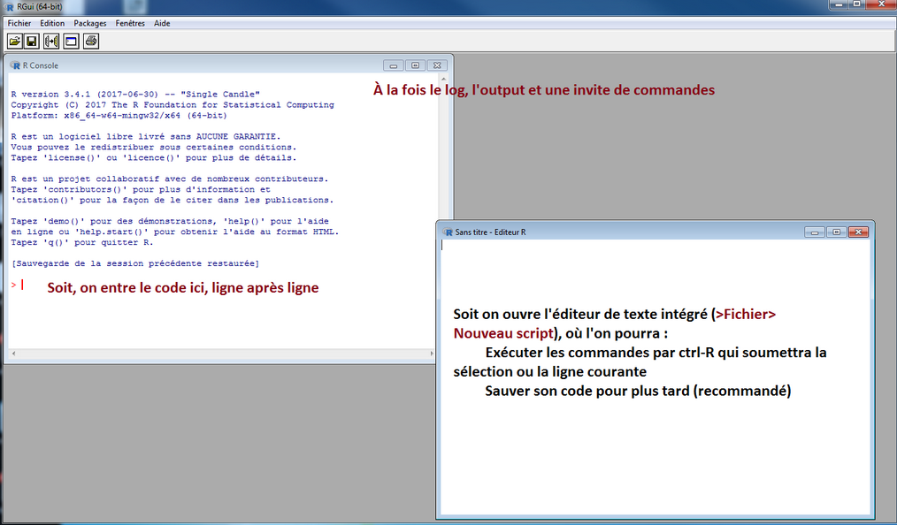

## Principes généraux

R est un langage de programmation complet

* scientifique
* multi-paradigme
* programmable

R est constitué d'un noyau constitué d'opérations de base et de fonctions travaillant généralement en RAM

On peut le complèter par des "packages", bibliothèques de fonctions à charger en tant que de besoin

* des domaines d'application variés (stats, graphiques, SGBD, sites interactifs, ...)
* complexité, efficacité et documentation hétérogènes
* grand nombre d'auteurs : pas de logique d'ensemble, recouvrements, ...

## Nous ne sommes pas seuls dans l'univeRs

Une galaxie de `r (n <- signif(nrow(available.packages()), 2))` packages, près de `r signif(17 * n, 3)` fonctions, pour :

* ajouter des fonctionnalités
* remplacer des parties du noyau par des alternatives plus efficaces ou ergonomiques
* interfacer R avec d'autres langages de programmation

## Travailler avec R : une question de mémoire

En SAS, le mode de travail habituel consiste à **appeler successivement des procédures**, qui prennent chacune **en entrée des fichiers de données** pour produire **des fichiers de données en sortie**. Ce qui se passe entre les deux est paramétré par l'utilisateur mais est assimilable à une boîte noire.

À l'inverse, R donne un maximum de contrôle sur la façon de traiter les données, qui sont des objets chargés en mémoire (RAM) et non des fichiers stockés sur le disque. 

La taille de la mémoire disponible peut donc devenir décisive pour les traitements.

### À L'Insee, trois environnements peuvent être mobilisés

* Le poste de travail individuel
* AUS (accès aux données sécurisées)
* Le [SSPCloud](https://www.sspcloud.fr/)

## L'interface de base : RGui

Quoique minimaliste, cette interface permet d'utiliser toute la puissance du langage R

## L'environnement de développement : Rstudio

Cette interface facilite la vie du statisticien et du développeur
C'est dans cet environnement que nous allons principalement travailler

## Prise en main de RStudio

Utiliser la console pour obtenir le résultat de 6 fois 9

Ouvrir une nouvelle fenêtre de script (*File > New File > R script* ou *CTRL + maj + N*) et y soumettre le même calcul (saisir le code, puis le sélectionner et cliquer sur le bouton *Run*)

## L'environnement : tout ce qui existe est un objet

Supprimer des objets de l'environnement

## L'invite de commandes : tout ce qui se produit est un appel de fonction

